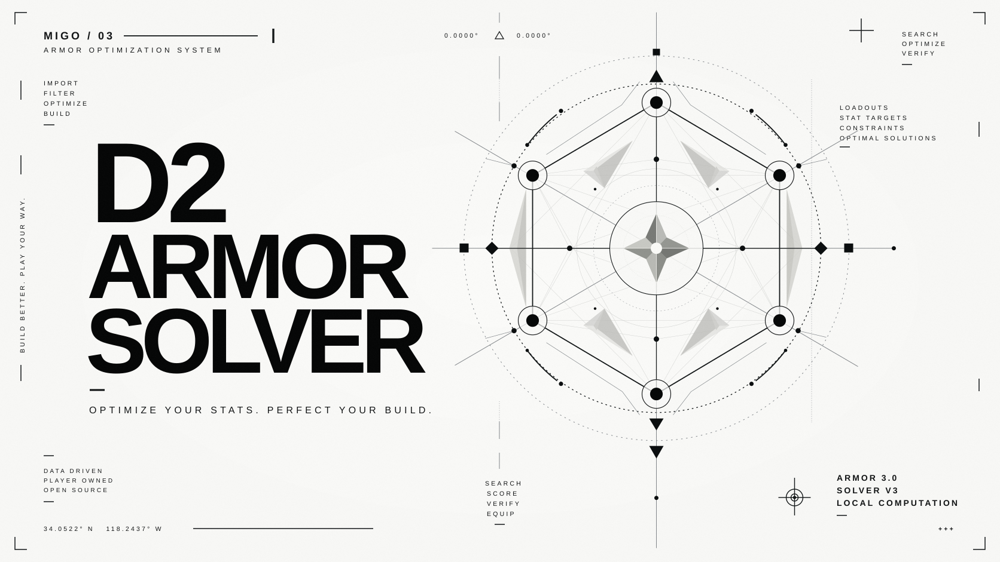

# Destiny 2 Armor Solver

[简体中文](README.md) · [English](README.en.md)

[](https://github.com/MIGO-OvO/d2-armor-solver/releases/latest)
[](https://github.com/MIGO-OvO/d2-armor-solver/actions/workflows/validate.yml)
[](https://vite.dev/)
[](https://v2.tauri.app/)
[](LICENSE)

A Tier 5 armor planner for Destiny 2 Armor 3.0. Build a theoretical loadout from six stat targets,
find combinations in your inventory, or plan replacements for your current armor.
Health, Melee, Grenade, Super, Class, and Weapons share one constraint model with Fragment bonuses,
Tuning, stat mods, Exotics, and armor sets.

**Free to use. No project account required. If you paid for this tool, you were scammed.**
Computation runs locally. Bungie sign-in is optional and only available in configured online deployments.

[Open solver](https://migo-ovo.github.io/d2-armor-solver/app/) ·
[User guide](https://migo-ovo.github.io/d2-armor-solver/guide/) ·
[Download for Windows](https://github.com/MIGO-OvO/d2-armor-solver/releases/latest) ·
[Project portal](https://migo-ovo.github.io/d2-armor-solver/)

## Choose a version

| Version | Access | Inventory | Requirements |
| --- | --- | --- | --- |
| Stable web | [Open main](https://migo-ovo.github.io/d2-armor-solver/app/) | DIM CSV; Bungie sync when configured | Modern browser |
| Development web | [Preview develop](https://migo-ovo.github.io/d2-armor-solver/dev/app/) | DIM CSV / Bungie | Preview changes; may be unstable |
| Windows desktop | [Download x64 installer](https://github.com/MIGO-OvO/d2-armor-solver/releases/latest/download/d2-armor-solver-windows-x64-setup.exe) | DIM CSV; no Bungie sign-in | Windows 10/11 x64 with WebView2 installed |
| Portable browser build | [Actions artifacts](https://github.com/MIGO-OvO/d2-armor-solver/actions/workflows/deploy-pages.yml), or build locally | DIM CSV; no Bungie sign-in | Extract and open `index.html`; Chrome / Edge recommended |

The Windows installer needs no Node.js, Rust, or local server. It does not bundle or install WebView2;
WebView2 120 or newer is recommended. The installer is unsigned, so Windows may warn about an unknown publisher.
Download only from this repository's Releases. There is no automatic updater; download a new installer to upgrade.
See [desktop documentation](docs/desktop.md) for requirements and validation details.

The portable browser ZIP is **not a current Release attachment**.
Push builds retain it as an Actions artifact for 14 days; downloading artifacts normally requires GitHub sign-in.
Extract the ZIP inside the artifact and open the entry point through `file://`.
This build runs without Workers, so large inventory searches may briefly block the UI.
Firefox restrictions on `file://` storage may prevent drafts and saved builds from persisting.
DIM links can be generated offline, but opening DIM or other external sites requires a connection.

## Quick start

1. Select a class. Start with theoretical armor, import an Armor CSV exported from DIM, or sign in to Bungie online.
2. Choose build-from-scratch or optimize-current-build mode. The latter can load equipped armor or accept five manually edited pieces.
3. Set six stat targets, priorities, and exact / at-least / at-most / range rules. Add Fragment changes and mod budgets.
4. Configure Exotic, Exotic class item perk, and set requirements as needed. Choose Fast / Balanced / Deep search.
5. Inspect the plan list and details: owned pieces, farming gaps, per-piece Tuning and mods, and replacement steps.
6. Save a build or export a DIM loadout link. Bungie inventory plans can be equipped only when execution requirements are met.

The [standalone guide](https://migo-ovo.github.io/d2-armor-solver/guide/) covers workflows, result panels, and FAQs
in Simplified Chinese, Traditional Chinese, and English.

## Features

- **Build from scratch:** derive five armor frames, reachable ranges, Tuning and mod assignments, and target differences.
- **Inventory planning:** parse DIM instances and installed modifiers, compare copies of the same Exotic,
  and produce owned-only or owned-plus-farming plans.
- **Exotics and sets:** pin regular Exotics, reserve unowned Exotics, select Exotic class item perks,
  and enforce 2-piece, 4-piece, or 2+2 set requirements.
- **Replacement planning:** preserve pinned pieces and search under hard rules; keep current armor when it already meets the target.
- **Unified results:** rank plans by rule satisfaction and ownership, with piece details, farming needs,
  replacement steps, and advanced diagnostics.
- **Saved builds:** search, load, rename, and delete with undo. Stale snapshots prompt a new search instead of being deleted.
- **Staged search:** progress, cancellation, and selectable budgets; web and desktop computation uses Web Workers.
- **Three languages:** Simplified Chinese, Traditional Chinese, and English, with a standalone guide and responsive layouts.

## Reading solver results

V3.1 retains the Solver V3 integer constraint model and result certificates.
Fast / Balanced / Deep change search budgets and proof depth, not game rules.
**A feasible result is not necessarily a global optimum. A search limit is not proof of infeasibility.**

| Status | Meaning |
| --- | --- |
| `EXACT_TARGET_PROVEN` | Concrete armor, Tuning, and mods reconstruct the exact target |
| `RULE_FEASIBLE_PROVEN` | The returned witness satisfies all hard rules |
| `INFEASIBLE_PROVEN` | A complete, trusted search-domain proof establishes infeasibility |
| `SEARCH_LIMIT_REACHED` | Coverage is incomplete; a feasible result may exist, but no infeasibility or global-optimum claim follows |
| `INVALID_INPUT` | Input violates model requirements and must be corrected |

Mathematical proof and execution status are separate.
`VERIFIED` means execution evidence is complete and passes preflight;
`UNVERIFIED` means evidence is missing; `BLOCKED` means an instance/socket preflight is blocked;
`NOT_APPLICABLE` is used for theoretical results without an execution check.
The main stat display shows mathematical totals. Installable totals belong to execution diagnostics and do not overwrite them.
Inventory proof is also tracked separately from global search completion.

See [architecture](docs/architecture.md), [consistency audit](docs/v3-consistency-audit.md),
and [staged search](docs/staged-search.md) for model boundaries and limits.

### Equip-to-game limitations

- Requires online sign-in, actual owned instances, and application write permissions.
  CSV data or theoretical frames alone do not provide full execution evidence.
- Preflight checks class, sockets, plug availability, energy, and fixed Tuning.
  Unavailable or unaffordable mod writes are reported as skipped or blocked.
- Custom plans use transfer, equip, and socket-write API calls. Partial failure can leave some operations completed;
  this is not an atomic transaction.
- Custom plans preserve the current subclass, Aspects, and Fragments.
  Direct equip requires the entered Fragment stat sum to match the character's current configuration.
- Only armor and armor mods are handled, not weapons. Exotic class items require matching real perk rolls;
  random perks cannot be rewritten.
- Existing in-game loadouts can be read and applied; this does not create arbitrary new in-game loadouts.
- Bungie may reject writes during activities. Use orbit, a social space, or an offline character,
  and rely on preflight, API responses, and read-back verification.

## Local development

Use **Node.js 22.13.0 or newer** and npm. CI uses Node.js 22; `package-lock.json` defines locked dependencies.

```bash
git clone https://github.com/MIGO-OvO/d2-armor-solver.git
cd d2-armor-solver
npm ci
npm run dev
```

Open the address printed by Vite. The root is the portal, `/app/` is the solver, and `/guide/` is the guide.
Bungie environment variables are optional for development; missing configuration hides sign-in.

| Command | Purpose |
| --- | --- |
| `npm run build` / `npm run preview` | Build `dist/` / preview the production site |
| `npm run build:offline` | Build `dist-offline/` for `file://` use |
| `npm run check` | ESLint, Node tests, upgrade regression, production build |
| `npm run test:consistency` | Witness consistency and V3 differential tests |
| `npm run test:browser` | Build and run browser smoke/layout regressions |
| `npm run verify:offline` | Build and verify the portable offline version |
| `npm run benchmark:v3` / `npm run benchmark:inventory` | V3 / realistic-scale synthetic inventory benchmarks |
| `npm run desktop:dev` | Start Tauri development |
| `npm run desktop:test` | Desktop frontend build and browser contract checks |
| `npm run desktop:build` | Build the Windows x64 NSIS installer |

Browser tests require local Chrome / Edge; set `CHROME_PATH` if automatic discovery fails.
Native desktop builds also require Rust stable MSVC, Visual Studio C++ Build Tools, and the Windows SDK.
Installers are written to `src-tauri/target/x86_64-pc-windows-msvc/release/bundle/nsis/`.
See [desktop documentation](docs/desktop.md) for native checks and offline acceptance testing.

## Repository structure

```text
d2-armor-solver/
├── index.html              # Portal entry
├── app/                    # Shared solver HTML template
├── guide/                  # Standalone guide entry
├── src/
│   ├── app.mjs             # UI state and result orchestration
│   ├── core/               # Constraints, solvers, DIM, Bungie, storage, built-in data
│   ├── workers/            # Worker entry
│   └── styles/             # Portal, workbench, and guide styles
├── desktop/                # React + TypeScript shell and shared UI bridge
├── src-tauri/              # Rust + Tauri 2, permissions, installer configuration
├── asset/                  # SVG brand hero, icons, and static assets
├── scripts/                # Builds, data generation, regression checks, benchmarks
├── tests/                  # Algorithms, inventory, execution contracts, fixtures
├── docs/                   # Architecture, audits, benchmarks, release notes
└── .github/workflows/      # Validation, dual-channel Pages, Windows releases
```

The web application uses vanilla JavaScript / HTML / CSS with Vite.
The desktop React shell mounts the shared template and solver modules; it is not a separate solver or a Rust algorithm port.

## Deployment and branches

Daily development targets `develop`; `main` is stable.
On pushes to either branch, the [Pages workflow](.github/workflows/deploy-pages.yml) validates and builds both channels,
placing stable at the root and development under `/dev/` in one GitHub Pages deployment.
Pushes to any branch also produce portable browser ZIP artifacts retained for 14 days.

The [Windows workflow](.github/workflows/desktop-windows.yml) builds on relevant code changes, PRs, or manual dispatch,
and attaches the Windows installer when a Release is published.
**The Pages workflow does not attach a browser ZIP to Releases.**
The [validation workflow](.github/workflows/validate.yml) covers check, V3 benchmarks, browser,
offline, and desktop frontend checks.

Other static hosts can serve `dist/` after `npm run build`.
Cloudflare Static Assets configuration is included: run `npx wrangler login`, then `npm run deploy`.
Bungie login remains disabled unless its configuration and the deployed origin are registered.

### Bungie deployment configuration and security

The build reads `BUNGIE_API_KEY`, `BUNGIE_OAUTH_CLIENT_ID`, and `BUNGIE_OAUTH_CLIENT_SECRET`.
The Pages workflow injects matching GitHub Actions Secrets.
Register the actual Origin and redirect URL with Bungie, and enable `MoveEquipDestinyItems` for equipment writes.
The stable callback is `https://migo-ovo.github.io/d2-armor-solver/app/`;
the local callback is `http://localhost:5173/app/`.
An Origin includes scheme, host, and port, not a path.

Both published channels share this configuration. Development authorization is forwarded from the stable callback
to `/dev/app/` and still validates OAuth state. Offline and desktop builds do not enable these credentials.

**Security limitation: the current implementation compiles the OAuth client secret into the static frontend,
where visitors can read it.** GitHub Secrets protect values before the build, not published browser code.
Do not treat this deployment as an architecture that can keep a confidential client secret.
Evaluate OAuth security before production deployment; secret-bearing token exchange belongs on a trusted server.
Never commit real credentials, authorization codes, or access tokens to source, issues, or logs.
This documentation update does not change the authentication implementation.

## Data and privacy

- Computation is local; targets, CSV files, and plans are not uploaded to a project server.
  Bungie sign-in, sync, and equipment operations contact Bungie.
- Drafts, preferences, and saved builds use local storage.
  **Clearing site or desktop application data removes them.**
- Same-origin stable and development channels share language and saved builds;
  drafts, calculation mode, and OAuth state use separate channel keys.
- Desktop WebView storage, different browsers, and other deployment origins do not automatically share or migrate data.
- Armor, mod, set, and Fragment catalogs come from Bungie Manifest and ship with project versions;
  they may lag behind game hotfixes.

## Version and technical documentation

The current source version is **v3.1.0**, including exact-target interval queries, inventory search optimizations,
the unified plan workspace, cross-channel saved builds, and the standalone three-language guide.

- [v3.1.0 release notes](docs/release-notes-v3.1.0.md) · [All releases](https://github.com/MIGO-OvO/d2-armor-solver/releases)
- [V3.1 optimization and methodology](docs/solver-v31-optimization.md) · [Raw benchmarks](docs/benchmarks/solver-v31.json)
- [Algorithm optimizations](docs/algorithm-optimization.md) · [Parallel inventory validation](docs/parallel-inventory-validation.md)

Benchmarks compare implementations on specific datasets and hardware;
they do not guarantee response times or global optimality for every inventory.

## Issues and contributions

Report problems through [GitHub Issues](https://github.com/MIGO-OvO/d2-armor-solver/issues).
For calculation issues, include version/channel, browser and OS, targets and rules, Fragment/mod budgets,
Exotic/set/pinned-piece settings, and expected versus actual results.
A minimal anonymized CSV helps. **Do not include OAuth tokens or complete authentication responses.**

Run `npm run check` and `npm run test:browser` before contributing;
also run the relevant offline or desktop checks when changing those paths.
Prefer pull requests targeting `develop`.

Maintainer: [@MIGO-OvO](https://github.com/MIGO-OvO) · Feedback group (QQ): 1104108070.

## License and acknowledgements

Code is available under the [MIT License](LICENSE).
Thanks to [liheng-Huang](https://github.com/liheng-Huang/d2-armor-solver) for the original project,
[Destiny Item Manager](https://destinyitemmanager.com/) for CSV exports and loadout workflows,
and Bungie for the Manifest and game data API.

Destiny, Destiny 2, associated trademarks, and game artwork belong to Bungie and their respective owners.
This is a community tool, not affiliated with or officially endorsed by Bungie or DIM.
