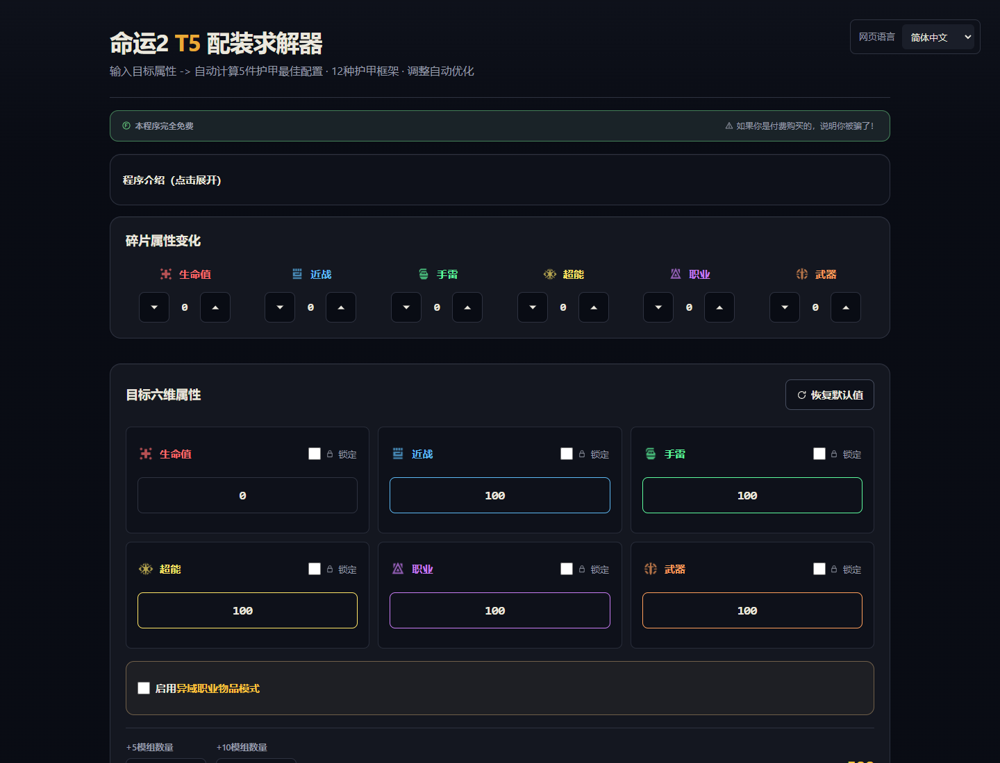

# Destiny 2 Armor Solver v2

[](https://developer.mozilla.org/docs/Web/JavaScript)
[](https://vite.dev/)
[](https://nodejs.org/)
[](https://github.com/MIGO-OvO/d2-armor-solver/actions/workflows/deploy-pages.yml)
[](https://migo-ovo.github.io/d2-armor-solver/)
[](https://github.com/MIGO-OvO/d2-armor-solver/releases/latest)
[](./LICENSE)

## Overview / 项目概览

面向《命运 2》Armor 3.0 的六维属性配装求解器。它既能从理论框架计算目标是否可达，也能导入 DIM 护甲清单，从玩家已经拥有的装备中寻找最佳组合、保留套装约束，并列出仍需刷取的护甲。

项目是完全静态的浏览器应用：根路径提供在线 / 离线双入口门户，求解器位于 `app/` 子路径。无需项目账号、无需后端，目标属性、DIM 清单和保存的方案都只保留在当前浏览器中。

## Live Site / 在线使用

门户：**[https://migo-ovo.github.io/d2-armor-solver/](https://migo-ovo.github.io/d2-armor-solver/)**

直接进入求解器：**[https://migo-ovo.github.io/d2-armor-solver/app/](https://migo-ovo.github.io/d2-armor-solver/app/)**

> 浏览器数据按站点来源隔离。GitHub Pages、本地开发地址和其他部署地址之间不会自动迁移草稿或已保存方案。



## 离线使用 / Offline Use

完全离线的独立构建，无需 Node、npm 或服务器：

1. 直接下载 [最新 Release 离线包](https://github.com/MIGO-OvO/d2-armor-solver/releases/latest/download/d2-armor-solver-offline.zip)，或在任意一次 push 的 [Actions](https://github.com/MIGO-OvO/d2-armor-solver/actions/workflows/deploy-pages.yml) 工件中获取抢先构建。
2. 解压后双击 `index.html`，通过 `file://` 协议在浏览器中打开即可使用。

离线包与在线版功能对等，仅一处差异：构建时**不注入 Bungie secrets**，因此 Bungie OAuth 登录入口被隐藏。DIM CSV 导入、求解和保存方案均可完全离线运行；DIM Loadout 导出链接本身只是 URL，打开时仍需联网。

浏览器支持：

- Chrome / Edge 完全支持。
- Firefox 通过 `file://` 打开时 `localStorage` 不可用，草稿和已保存方案不会在刷新后保留，应用其余功能不受影响。

离线构建使用主线程引擎（`__OFFLINE_MODE__` 下不会启动 Web Worker），重型库存求解时界面可能短暂无响应，属预期行为。数据 100% 留在本机，与在线版一致；由于不访问任何 CDN，隐私保障反而更强。

## v2.0.0 主要更新

v2 是一次围绕“真实库存配装”的主版本升级：

- 支持导入 DIM Armor CSV，识别职业、栏位、Tier、异域、当前穿戴、基础属性、套装和大师等级。
- 从 DIM 显示属性中推断已安装的 `+3` / `+5/-5` 调整与 `+5` / `+10` 属性模组。
- 新增已有护甲求解：优先使用库存中的精确匹配件，并明确显示仍需刷取的栏位、框架和调整方向。
- 支持普通异域固定、异域职业物品，以及同名异域多件之间的最接近属性比较。
- 支持指定套装 `4 件套`、`2 件套` 和 `2+2` 双套装约束；内置 56 组 Bungie Manifest 套装数据。
- 已有护甲方案可导出为 DIM 配装链接，并携带护甲实例、属性模组和调整模组设置。
- “优化现有配装”支持必须达标属性、真实护甲分布、固定件和按收益排序的替换计划。
- 重做 DIM 导入、库存结果和替换规划界面，完善桌面端、390px 窄屏、键盘焦点和状态反馈。
- 求解、可达范围、库存搜索和替换分析均通过 Web Worker 执行，避免阻塞主界面。

完整版本说明见 [v2.0.0 Release](https://github.com/MIGO-OvO/d2-armor-solver/releases/tag/v2.0.0)。

## 核心功能

### 从零配装

- 设置生命、近战、手雷、超能、职业和武器六维目标。
- 应用碎片属性变化、`+5` / `+10` 属性模组和 `+3` / `+5/-5` 调整。
- 可锁定目标，或限定方案只使用 `+5/-5` 调整。
- 枚举五件护甲框架，显示目标差值、理论可达范围和刷取需求。
- 支持异域职业物品的职业、左右栏特性及固定 `30/25/20` 框架。

### DIM 库存规划

- 按职业和 Tier 5 筛选已导入护甲。
- 优先匹配已有护甲，再按刷取件数和属性接近程度排序方案。
- 固定普通异域的部位与名称；同名多件会自动比较框架、第三属性和调整。
- 为目标方案指定套装要求，并确保库存组合或刷取建议满足件数约束。
- 查看完全由已有护甲组成的方案，或查看“已有 + 待刷”的混合规划。

### 优化现有配装

- 从 DIM 当前穿戴自动填入五件护甲，也可以逐件手动配置。
- 异域或不希望替换的装备可固定保留。
- 为关键属性勾选“必须达标”，优先满足硬约束后再比较总缺口。
- 输出当前状态、替换后六维、逐步替换顺序、调整分配和属性模组分配。
- 当现有装备已经足够时，会明确给出无需刷取的保留方案。

### 其他能力

- 简体中文、繁体中文和 English 界面。
- 草稿、语言、模式和命名方案自动保存在 `localStorage`。
- 支持减少动态效果、键盘操作、清晰焦点和 `aria-live` 状态播报。
- GitHub Pages 与 Cloudflare Workers Static Assets 使用同一份生产构建。

## Usage / 导入与导出 DIM

### 导入护甲清单

在 DIM 中依次进入：

```text
DIM → Settings → Spreadsheets → Armor → Export CSV
```

回到求解器后点击“选择 DIM CSV”。文件仅在浏览器内解析，不会上传到服务器。

导入后建议依次完成：

1. 选择职业并决定是否只使用 Tier 5 护甲。
2. 如需固定普通异域，选择异域部位和名称。
3. 设置六维目标、碎片和套装约束。
4. 运行求解，比较已有件和待刷件。

### 导出 DIM 配装

完全由已有护甲组成的方案可以生成 DIM Loadout 链接。链接包含 DIM 实例 ID、属性模组和调整模组；打开前请确保浏览器已经登录 DIM。

DIM 会忽略账号未拥有的模组，应用模组前护甲也需要满足游戏内能量与大师等级要求。

## Getting Started / 本地运行

### 环境要求

- Node.js `22.13.0` 或更高版本
- npm
- 可选：Chrome 或 Edge，用于浏览器回归测试

### Installation / 安装

```bash
git clone https://github.com/MIGO-OvO/d2-armor-solver.git
cd d2-armor-solver
npm ci
```

### 开发服务器

```bash
npm run dev
```

根据终端提示打开本地地址。Windows 用户也可以运行 `start_windows.bat`，脚本会安装缺失依赖并打开浏览器。

### 常用命令

| 命令 | 用途 |
| --- | --- |
| `npm run dev` | 启动 Vite 开发服务器 |
| `npm run build` | 生成 `dist/` 生产构建 |
| `npm run build:offline` | 生成只含求解器的 `dist-offline/` 离线构建 |
| `npm run preview` | 本地预览生产构建 |
| `npm run lint` | 运行 ESLint |
| `npm test` | 运行确定性算法测试 |
| `npm run test:upgrade` | 运行随机替换规划回归测试 |
| `npm run test:browser` | 使用本机 Chrome/Edge 验证 Worker、交互和 390px 布局 |
| `npm run verify:offline` | 构建并通过 `file://` 验证离线版 |
| `npm run check` | 依次执行 lint、测试、替换回归和构建 |
| `npm run deploy` | 使用 Wrangler 部署 Cloudflare 静态资源 |

## 项目结构

```text
d2-armor-solver/
├─ .github/workflows/        # GitHub Pages 持续部署
├─ app/
│  └─ index.html             # 在线求解器页面（/app/）
├─ asset/                    # 图标源文件与 README 配图
├─ docs/architecture.md      # 模块、Worker 与存储边界说明
├─ scripts/
│  ├─ build.mjs              # 生产构建与静态资源处理
│  ├─ build-offline.mjs      # 单入口、可通过 file:// 运行的离线构建
│  ├─ verify-offline.mjs     # 离线包浏览器验证
│  ├─ browser-smoke.mjs      # 浏览器端回归检查
│  └─ fetch-armor-mod-data.mjs
├─ src/
│  ├─ portal.mjs             # 门户三语切换
│  ├─ app.mjs                # 浏览器工作台与界面编排
│  ├─ core/
│  │  ├─ armor-engine.mjs    # 求解器统一接口
│  │  ├─ dim-csv.mjs         # DIM CSV 解析与模组推断
│  │  ├─ inventory-solver.mjs # 已有护甲组合搜索
│  │  ├─ inventory-plan.mjs  # 已有/待刷混合规划
│  │  ├─ armor-sets.mjs      # 套装目录与激活规则
│  │  └─ upgrade-optimizer.mjs
│  ├─ workers/               # 非阻塞算法 Worker
│  └─ styles/
│     ├─ portal.css          # 门户视觉与响应式样式
│     └─ app.css             # 求解器响应式界面样式
├─ tests/                    # 算法、DIM、库存和结构测试
├─ index.html                # 根路径门户页面
└─ package.json
```

更详细的模块关系见 [架构说明](./docs/architecture.md)。

## 部署

推送后，[Deploy GitHub Pages](.github/workflows/deploy-pages.yml) 会：

1. 每个分支的 push 都构建离线 zip，并作为保留 14 天的 Actions 工件上传，供抢先体验。
2. `main` 分支使用 Node.js 22 安装锁定依赖并执行 `npm run check`。
3. 验证 `dist/index.html` 门户、`dist/app/index.html` 求解器和兼容跳转均已正确打包。
4. 将同一份 `dist/` 发布到 GitHub Pages；发布 Release 时，离线 zip 会自动附加到该 Release。

Cloudflare 部署使用：

```bash
npx wrangler login
npm run deploy
```

`dist/`、`node_modules/`、Wrangler 本地状态和 Agent 工作文件均被排除在版本控制之外。

## 数据来源、隐私与免责声明

- 护甲套装、物品哈希和模组数据来自 Bungie Manifest；生成后的静态数据随版本发布。
- Destiny、Destiny 2、相关名称、商标和游戏美术资源归 Bungie 及其权利人所有。
- 本项目与 Bungie、Destiny Item Manager 没有隶属或官方认可关系。
- 应用运行时不会把目标、清单或配装发送到项目服务器。
- 清除当前站点的浏览器数据会同时删除草稿和已保存方案。

## Bungie 登录设置

Bungie 登录（OAuth）用于获取真实库存，需要部署侧预先配置。注册与配置由仓库维护者手动完成，步骤如下：

1. 打开 [bungie.net/en/Application](https://www.bungie.net/en/Application) 创建 Bungie 应用：
   - 客户端类型选择 **Confidential**。
   - Redirect URL 注册 `https://migo-ovo.github.io/d2-armor-solver/app/` 与 `http://localhost:5173/app/`。
   - Origin 注册 `https://migo-ovo.github.io` 与 `http://localhost:5173`。Origin 只包含协议、主机和端口，不包含 `/d2-armor-solver/app/` 路径；浏览器发起请求时的 Origin 必须与登记值一致（不支持通配符），否则 Bungie 会以 CORS 拒绝。
   - 从旧版升级时，必须把原先指向仓库根路径的 Redirect URL 改为上述 `app/` 子路径，否则 OAuth 回调会落到门户而无法完成登录。
2. 从应用页面取得三件套：**API Key**、**OAuth Client ID**、**OAuth Client Secret**。
3. 在 GitHub 仓库 → **Settings → Secrets and variables → Actions** 添加同名 secrets：`BUNGIE_API_KEY`、`BUNGIE_OAUTH_CLIENT_ID`、`BUNGIE_OAUTH_CLIENT_SECRET`。
4. Cloudflare 部署**不启用** Bungie 登录（该源未在门户注册）。登录仅支持 GitHub Pages 正式站与本地开发（`http://localhost:5173`）。
5. 构建回退：未配置 secrets 时构建仍然成功，登录入口自动隐藏。

> 请勿在仓库、Issue 或任何文档中提交真实 secret 值；GitHub Secrets 只在 Actions 运行期间注入构建过程。

## 质量保证

发布前质量门禁覆盖：

- 护甲规则、预算平衡、可达范围和替换规划。
- DIM CSV 的 BOM、引号、CRLF、多语言字段和真实属性推断。
- 套装成员、`2 件 / 4 件 / 2+2` 约束和固定异域。
- 同哈希不同实例、已有件优先级和待刷建议。
- Worker 请求、模式切换、目标同步和 390px 响应式布局。

## Issues and Contributing / 反馈与贡献

欢迎通过 [GitHub Issues](https://github.com/MIGO-OvO/d2-armor-solver/issues) 报告问题或提出建议。计算错误请尽量附上：

- 六维目标与碎片变化
- 模组、异域和套装设置
- DIM CSV 中相关装备的栏位与属性
- 预期结果和实际结果
- 浏览器与操作系统版本

提交 Pull Request 前请运行：

```bash
npm run check
npm run test:browser
```

## License

本项目使用 [MIT License](./LICENSE) 发布。

## Acknowledgements / 致谢

- [liheng-Huang](https://github.com/liheng-Huang) 提供初始版本与源仓库。
- [MIGO-OvO](https://github.com/MIGO-OvO) 维护当前 fork 与后续版本。
- [Destiny Item Manager](https://destinyitemmanager.com/) 提供护甲清单导出与 Loadout 工作流。
- Bungie 提供 Destiny 2 Manifest 与游戏数据接口。

## Contact / 联系方式

维护者：[@MIGO-OvO](https://github.com/MIGO-OvO)

功能和计算规则讨论请优先使用 [GitHub Issues](https://github.com/MIGO-OvO/d2-armor-solver/issues)。
